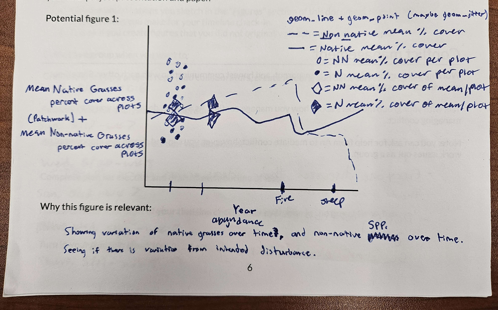
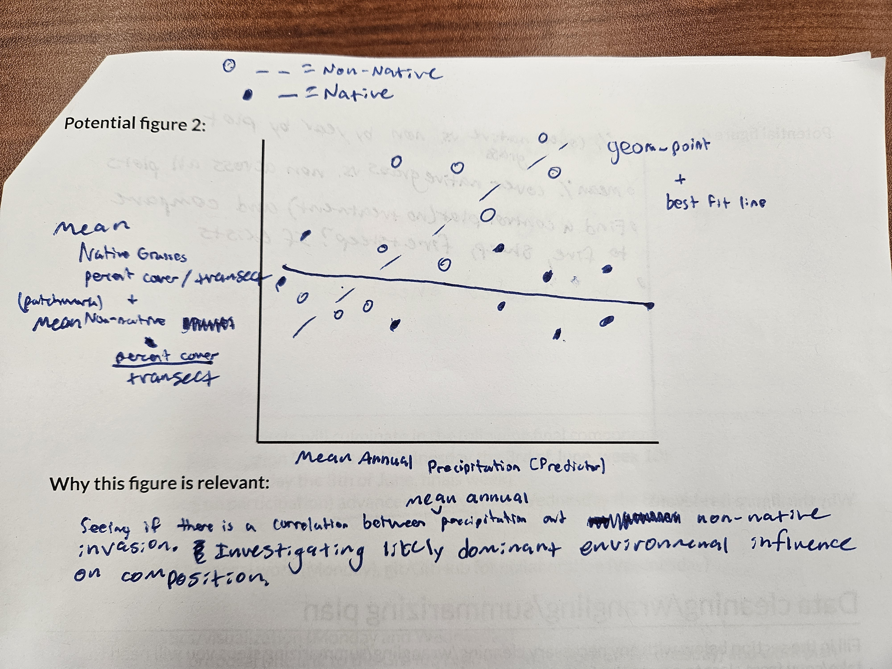
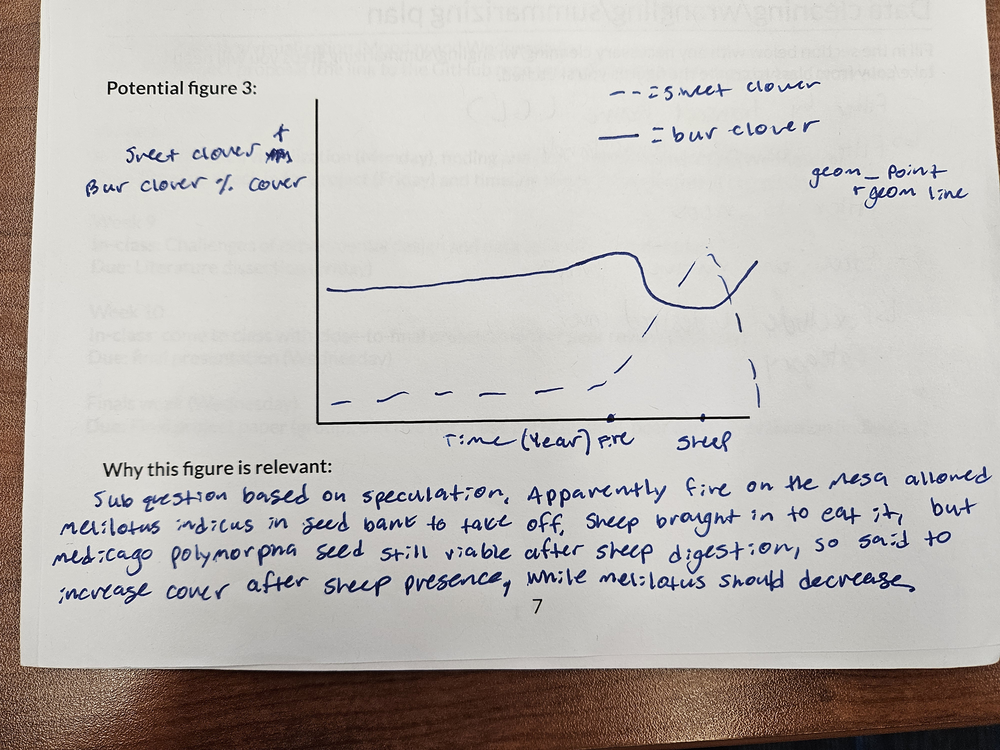
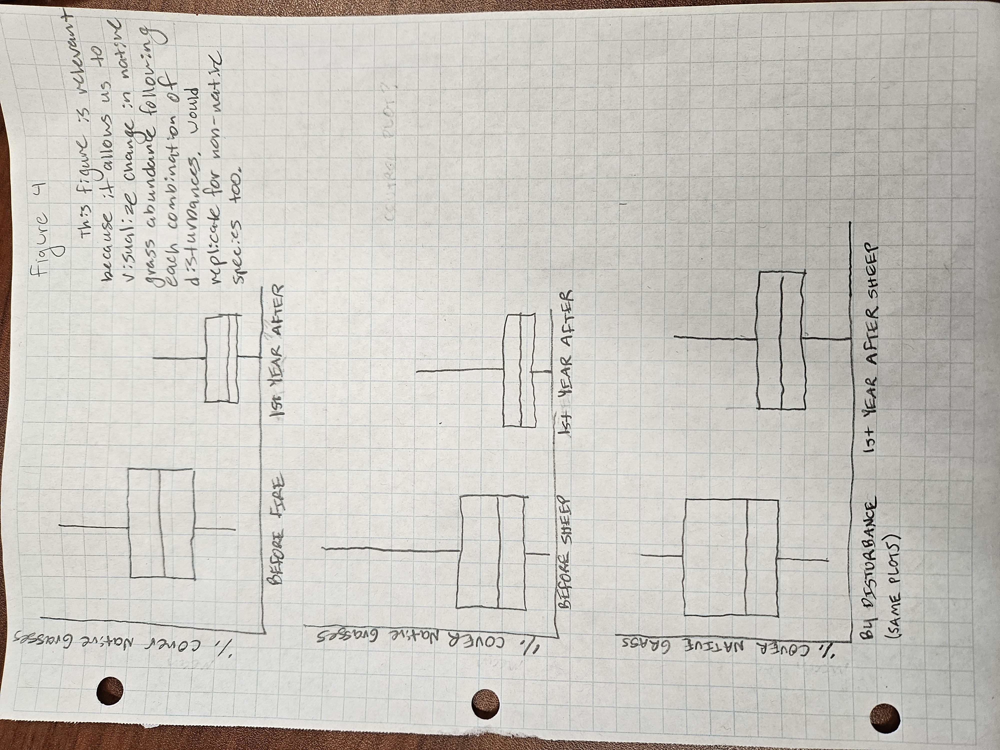

# Group project proposal

**Spring 2026**

Directions:

- Use your work plan from class to fill in the information below.
- Practice pulling, making changes, staging/committing/pulling/pushing to the same repo.
- **Communicate about who is doing what throughout the entire process.**

What you will submit on Friday the 15th:

- proposal: a link to your forked repository with the completed proposal in the README
- work plan: your paper plan that you completed in class on Monday the 4th

Use your project proposal to:

- refer back to the original plan while you are working
- keep track of high-level changes in structure (e.g. role switching, elective modifications)

Note:

- your project proposal is subject to change after you learn more about your datasets and what is possible - allow yourselves the flexibility to make adjustments as needed
- the more detail you can provide in your proposal, the more thorough your feedback will be

## Group members

Lukas Lescano, Garrett Mellinger, Minh Tri Ngo

## Topic information and question

**Topic:**  

Vegetation

**Question(s):**  

- How does the percent cover of native grasses (i.e. Stipa Pulchra) vary over time 
compared to the percent cover of exotic vegetation on the NCOS Mesa (Perennial Grasslands)?
    - How does intentional disturbance(i.e. Fall 2023 Prescribed Burn and Fall 2024 
    Rotational Sheep Grassing) influence this relationship?

**Response variable(s)**

- Native grasses percent cover
- Nonnative species percent cover
- Stipa pulchra percent cover
- Melilotus indicus percent cover
- Medicago polymorpha percent cover

## Datasets

**Datasets used:**

- vegetation
- metadata
- weather

## Figures

**Potential figure 1:**

**Potential figure 2:**

**Potential figure 3:**

**Potential figure 4**

## Data cleaning/wrangling/summarizing plan

- create new object for target species
- filter by transect name (GL) (filtering to grasslands)
- filter to ncos
- filter out "exclude others list" (this list includes: shrubs, trees, bare ground, rocks, unlisted, sedges, and rushes)
- filter out native forbs

## Project roles

**Natural history/framing director:**

Garrett Mellinger

**Stats and visualization director**

Lukas Lescano

**GitHub/code director**

Minh Tri Ngo

## Elective (not required for all groups or group members)

**Group members completing elective:**

Lukas Lescano, Garrett Mellinger, Minh Tri Ngo

**Elective idea:**

Photo Journal of each transects
Film presenting vegetation at NCOS
ArcGIS visualization of landscape percent cover differences

**Elective timeline (what you will have completed each week):**

Week 7: 
- Thursday 5/14 - Finish the project proposal; go over with group members and submit it
- **Friday 5/15 - due date for the project proposal**
- Sunday 5/17 - Finalize ideas for analysis and background 
AND complete plan for elective and draft of idea

Week 8 (timeline check in): 
- Wednesday 5/20 - 
1: complete exploratory data analysis code and interpretation of the exploratory visualizations. 
2: get close to a complete final draft for the timeline check-in, and have every group member review it before submission 
3. get close to a complete final draft for elective timeline check-in (plan for completion and draft or outline of the idea) and have every group member review it before submission

- Thursday 5/21 - we plan to have the project timeline check-in and elective timeline check-in completed a day before the due date
- **Friday 5/22 - due date for project timeline check-in and elective** 

Week 9:
- Thursday 5/28 - we plan to have the literature dissection done and plan to review it with group members and submit it on this day
- **Friday 5/29 - due date for literature dissection**
- Saturday 5/30 - plan to have project presentation done and review it with group members to be prepared for the presentation peer review in class on the following Monday.

Week 10:
- **Monday 6/1 - due date for project presentation to be ready for in-class peer review**
- Tuesday 6/2 - meet with group and review feedback, make changes to presentation, and practice delivery of presentation
- **Wednesday 6/3 - final presentation due date for in-class presentations**
- Friday 6/5 - meet with group and finalize advanced elective
- Saturday 6/6 - meet with group and discuss project paper and assign roles. Work on completing project paper throughout the weekend
Finals week:
- Tuesday 6/9 - meet with group, revised project paper, finalize edits and submit
- **Wednesday 6/10 - due date for the final project paper**
- **Wednesday 6/10 - due date for the advanced elective**
- **Wednesday 6/10 - due date for peer self-evaluation**

